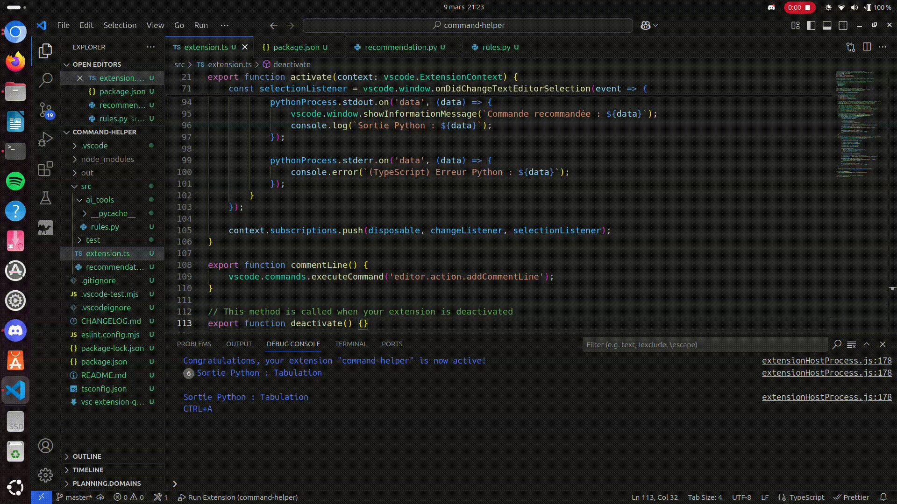

# VSCodeCommandHelper - Projet AI2D

VSCodeCommandHelper est une extension pour VS Code qui assiste les développeurs en suggérant les commandes les plus optimales selon le contexte et les actions effectuées. Ce projet combine IA, développement logiciel et IHM pour améliorer l’expérience utilisateur et optimiser l’usage des fonctionnalités de l’éditeur.
Ce projet est encadré par Gilles Bailly et Julien Gori.

## Utilisation

L'exécution du projet de recommandation nécessite d'avoir un terminal bash avec les droits d'exécution ainsi que Node.js et VSCode avec la "bonne" version. Pour les utilisateurs de MAC, il faut installer la commande 'code' pour pouvoir lancer la commande [TODO] ...

Le projet est découpé en 3 extensions :

1. Une extension pour un affichage "avancé" mais pour quelques commandes basiques;
2. Une extension plus générique avec un affichage "simple" qui peut recommander un nombre arbitraire de commandes;
3. Une extension pour la simulation des commandes nécessaire au fonctionnement de l'extension générique.

### Extension affichage avancé

### Extension générique par simulation

Lorsque l'utilisateur modifie le fichier sur lequel il travaille (changement de position du curseur et modification du texte), un nouvel
Placez-vous dans le répertoire __VSCodeCommandHelper__ et lancez la commande :

    ./start
    
Cela ouvre deux fenêtres, une pour la simulation des commandes (voir rapport ?) et une pour l'éditeur principal de l'utilisateur (celui dans lequel l'utilisateur va travailler). Placez vous dans la fenêtre correspondant

